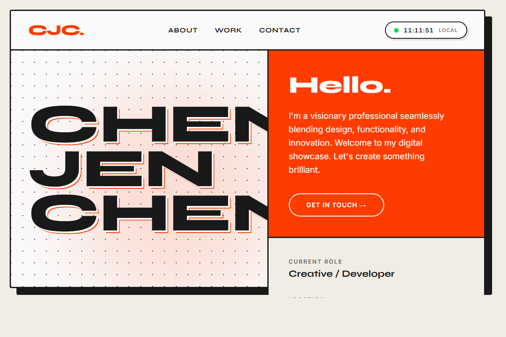

# Cheng Jen Chen - Digital Portfolio

A visually striking, brutalist-inspired single-page digital portfolio. This project is highly influenced by premium, typography-driven UI design templates used by modern creative professionals, featuring bold structures and vibrant accents.



## Features

* **Brutalist / Grid-Based Architecture:** The interface utilizes distinct bordered blocks, sharp lines, and unapologetic fullscreen framing to compartmentalize content.
* **Striking Typography:** Employs maximum-contrast pairings using **Syne** for ultra-bold, oversized headings and **Inter** for crisp, highly legible body text.
* **Vibrant Accent Colors:** Uses a stark off-white and pure black palette, unexpectedly intersected by a highly vivid orange-red accent and a dotted hero background.
* **Live "Pulse" Widget:** A dynamic, real-time localized digital clock, complete with a blinking LED-style live indicator.
* **Responsive Reflow:** The complex grid system seamlessly collapses into a linear vertical layout on mobile devices, maintaining readability and style.

## Technologies Used

* **HTML5:** Semantic document structuring with focused section blocks setup.
* **CSS3:** Heavy use of Flexbox for the rigid grid, CSS Variables for theming, keyframe animations (like the pulse indicator), and responsive `@media` queries.
* **Vanilla JavaScript:** Real-time clock calculation and DOM rendering logic.

## Project Structure

* `index.html` - The HTML backbone, embedding Google Fonts and semantic block containers.
* `index.css` - The visual ruleset implementing the brutalist theme, thick borders, typography, and responsive grid layouts.
* `index.js` - The script responsible for the live localized digital clock.

## How to View

You can view the site entirely locally—no build steps or servers are required:
1. Clone the repository to your local machine:
   ```bash
   git clone https://github.com/yuurei0217/AloT-week2.git
   ```
2. Open the directory and simply open `index.html` in any modern web browser.
